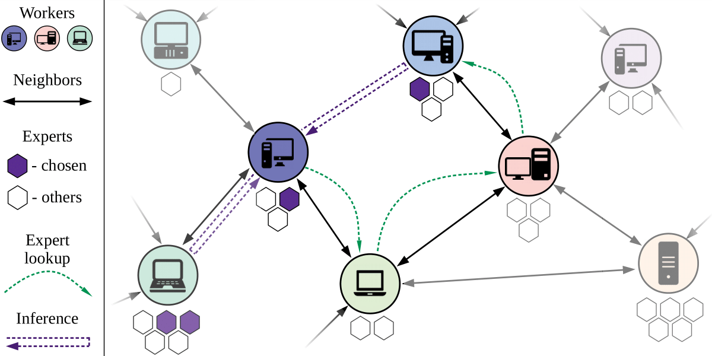

## Learning@home: Towards Crowdsourced Training of Large Neural Networks using Decentralized Mixture-of-Experts


PyTorch original implementation of ["Towards Crowdsourced Training of Large Neural Networks using Decentralized Mixture-of-Experts"](https://arxiv.org/abs/2002.04013) (NeurIPS 2020).

__TL;DR:__ Learning@home is an approach for training large (up to multi-terabyte) neural networks on hardware provided by volunteers with unreliable and slow connection.

__This repository__ contains a snapshot of Learning@home that was used to conduct initial experiments. While this snapshot implements the main functionality of Learning@home, it should be treated as a testbed to reproduce our experiments, __not__ as a finished library (see limitations below). To see an updated implementation designed for practical use, please refer to the [hivemind](https://github.com/learning-at-home/hivemind) project.  


## What do I need to run it?
* One or several computers, each equipped with at least one GPU
* Each computer should have at least two open ports (if not, consider ssh port forwarding)
* Some popular Linux x64 distribution
  * Tested on Ubuntu16.04, should work fine on any popular linux64 and even MacOS;
  * Running on Windows natively is not supported, please use vm or docker;

## How do I run it?
1. Clone or download this repo. `cd` to its root directory.
2. Create a working python enviromnent. [Anaconda](https://www.anaconda.com/) works fine.
3. Install packages from `requirements.txt`
4. Follow the instructions in the next section

## Running the experiments

### Throughput

All three scripts are contained in the folder `throughput` and are ready for customized benchmark runs. 

To run the baseline with parameters from the paper, use 

```python baseline_throughput.py --batches-for-latency 5 --batches-for-throughput 10 --batch-size 4 --throughput-runs 5 --linspace-points 10 --block-type transformer --layers-per-gpu 56 --gpus 0 1 2 3``` 

For testing Learning@home throughput under latency, first start the server for each GPU you have with 

```python throughput_server.py -a 16 -p PORT_NUMBER --block_type BLOCK_TYPE --gpu GPU_NUMBER```
 
 and then run a multiple-trainer client with commands like
 
```python throughput_client.py -j 64 --batches-for-latency 5 --batches-for-throughput 2 --throughput-runs 5 --linspace-points 10 --layers-per-gpu 56 --block-type ffn --hosts HOSTAME1:PORT_NUMBER1 HOSTAME2:PORT_NUMBER2”```
 
```python throughput_client.py -j 64 --batches-for-latency 5 --batches-for-throughput 2 --throughput-runs 5 --linspace-points 10 --layers-per-gpu 56 --block-type transformer --max-ping 0.2 --hosts HOSTAME1:PORT_NUMBER1 HOSTAME2:PORT_NUMBER2 --batch-size 4```

### Convergence
This experiment can be conducted both in a distributed setting and with an emulator. We recommend using the emulator to make results hardware-agnostic and reduce variance due to CPU and network interference from other processes.

You can find notebooks for [large FFN](./experiments/convergence/convergence_mnist_64workers_1000ms_seed1337_largeffn.ipynb), [DMoE with 64 experts](./experiments/convergence/convergence_mnist_64workers_1000ms_seed1337_dmoe64x4.ipynb), [DMoE with 4096 experts](./experiments/convergence/convergence_mnist_fail01_64workers_1000ms_seed1338_dmoe1024x4_cpu.ipynb) in [`./experiments/convergence`](./experiments/convergence).

Below we include the full grid of parameters used to conduct convergence experiments:

| `setup` | `notebook` |`experts_per_layer` | `num_trainers` | `batch_size` | `delay_ms` |
|---|---|---|---|---|---|
| `100ms large ffn` | [click](./experiments/convergence/convergence_mnist_64workers_1000ms_seed1337_largeffn.ipynb)|`-`|`64`| `4` |`100`|
| `100ms 64 experts` | [click](./experiments/convergence/convergence_mnist_64workers_1000ms_seed1337_dmoe64x4.ipynb)|`16`|`16`| `4`|`100`|
| `100ms 256 experts` | [click](./experiments/convergence/convergence_mnist_64workers_1000ms_seed1337_dmoe64x4.ipynb)|`64`|`64`|`4`|`100`|
| `100ms 4096 experts` | [click](./experiments/convergence/convergence_mnist_64workers_1000ms_seed1337_dmoe64x4.ipynb)|`1024`|`64`|`8`|`100`|
| `1000ms large ffn` | [click](./experiments/convergence/convergence_mnist_64workers_1000ms_seed1337_largeffn.ipynb)|`-`|`64`| `4` |`1000`|
| `1000ms 64 experts` | [click](./experiments/convergence/convergence_mnist_64workers_1000ms_seed1337_dmoe64x4.ipynb)|`16`|`16`| `4`|`1000`|
| `1000ms 256 experts` | [click](./experiments/convergence/convergence_mnist_64workers_1000ms_seed1337_dmoe64x4.ipynb)|`64`|`64`|`4`|`1000`|
| `1000ms 4096 experts` | [click](./experiments/convergence/convergence_mnist_64workers_1000ms_seed1337_dmoe64x4.ipynb)|`1024`|`64`|`8`|`1000`|
| `10% failure 64 experts` | [click](./experiments/convergence/convergence_mnist_fail01_64workers_1000ms_seed1338_dmoe1024x4_cpu.ipynb)|`16`|`16`| `4`|`1000`|
| `10% failure 256 experts` | [click](./experiments/convergence/convergence_mnist_fail01_64workers_1000ms_seed1338_dmoe1024x4_cpu.ipynb)|`64`|`64`|`4`|`1000`|
| `10% failure 4096 experts` | [click](./experiments/convergence/convergence_mnist_fail01_64workers_1000ms_seed1338_dmoe1024x4_cpu.ipynb)|`1024`|`64`|`8`|`1000`|

You can reproduce the curves in Figure 4 by opening the associated notebook, setting parameters as described in the table and iterating through random seeds 1337-1341 (including both borders).

Please note that these experiments can take up a lot of GPU memory due to storing "stale" gradients. With 16 trainers, the code should fit well into consumer GPU. For 4096 experts, we bypassed the memory limit by running on CPU.

### Gating function over DHT
We also provide a reference implementation of DMoE gating function over Kademlia DHT via `lib.GatingFunction`.

In order to test our implementation, you need to do two things:

First, set up DHT with at least one server process:
```python
import torch
import lib

# initial kademlia node
node_zero = lib.TesseractNetwork(port=ROOT_PORT, start=True)


# create experts. Warning: expert uids must be unique
experts = {}
for expert_uid in expert_uids:
    expert = torch.jit.script(NetworkBlock(1024))
    expert_backend = lib.ExpertBackend(
        name=expert_uid, expert=expert, opt=torch.optim.Adam(expert.parameters(), amsgrad=True),
        args_schema=(lib.BatchTensorProto(1024),), outputs_schema=lib.BatchTensorProto(1024),
        max_batch_size=2048, pool_size=8)
    experts[expert_uid] = expert_backend

# set up server(s)
runtime = lib.TesseractServer(lib.TesseractNetwork(('127.0.0.1', ROOT_PORT), port=SOME_OTHER_PORT, start=rue),
                              experts, port=PORTS[0], conn_handler_processes=64,
                              sender_threads=1, device=torch.device('cuda'),
                              start=True)
# after creating node_zero you can create additional TesseractServer instances in separate processes
```

Second, create a client process and connect to any DHT node:
```python
import torch
import lib

# create one or several backends with expert uids following the "expert.[0-32).[0-32)" pattern
# all backends must have TesseractNetwork active

network = lib.TesseractNetwork(('127.0.0.1', ROOT_PORT), port=SOME_NEW_PORT, start=True)
dmoe = lib.GatingFunction(in_features=1024, grid_size=[32, 32], k_best=4, network=network, uid_prefix='expert')

average_out = dmoe(torch.randn(32, 1024))
average_out.sum().backward()
```


## Learning@home quick tour

__Trainer process:__
  * __`RemoteExpert`__(`lib/client/remote_expert.py`) behaves like a pytorch module with autograd support but actually sends request to a remote runtime.
  * __`GatingFunction`__(`lib/client/gating_function.py`) finds best experts for a given input and either returns them as `RemoteExpert` or applies them right away.

__Runtime process:__
  * __`TesseractRuntime`__ (`lib/runtime/__init__.py`) aggregates batches and performs inference/training of experts according to their priority. 
  * __`TesseractServer`__ (`lib/server/__init__.py`) wraps runtime and periodically uploads experts into DHT.

__DHT:__
   * __`TesseractNetwork`__(`lib/network/__init__.py`) is a node of Kademlia-based DHT that stores metadata used by trainer and runtime.

## Limitations
As stated above, this implementation is a testbed for experiments, not a feature-complete library. More specifically:

* After finding best experts across DHT, a client still connects to these experts via hostname/port. Updated version connects to experts via DHT, allowing users to host servers with no public hostname or under NAT.
* Runtime processes do not handle errors. In the updated version, any errors on server are reported to the client.
* This implementation uses basic Kademlia protocol. Updated version modifies Kademlia to speed up searching for alive experts.

An updated version of the library is available at https://github.com/learning-at-home/hivemind.

## References
[Towards Crowdsourced Training of Large Neural Networks using Decentralized Mixture-of-Experts](https://arxiv.org/abs/2002.04013) (Max Ryabinin and Anton Gusev, NeurIPS 2020).
```
@misc{ryabinin2020crowdsourced,
      title={Towards Crowdsourced Training of Large Neural Networks using Decentralized Mixture-of-Experts}, 
      author={Max Ryabinin and Anton Gusev},
      year={2020},
      eprint={2002.04013},
      archivePrefix={arXiv},
      primaryClass={cs.DC}
}
```